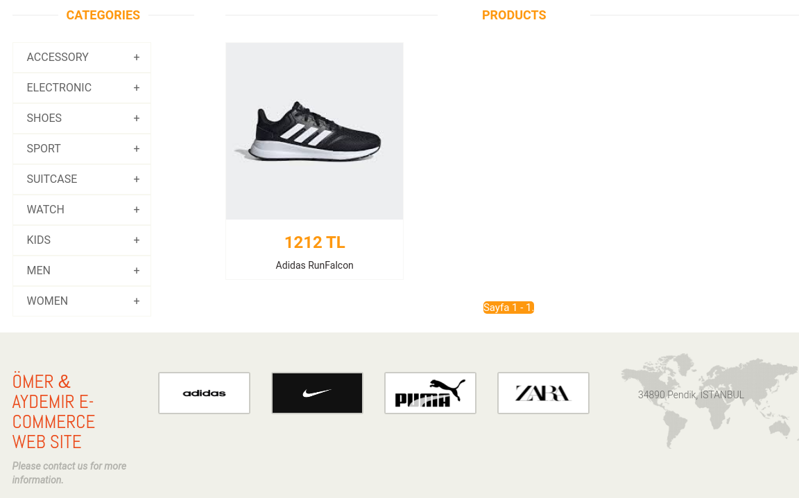
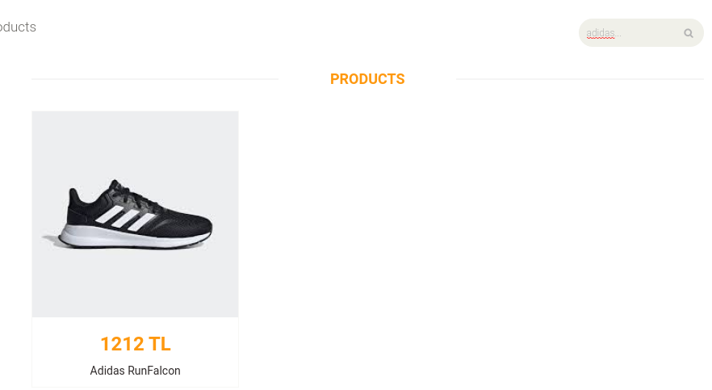
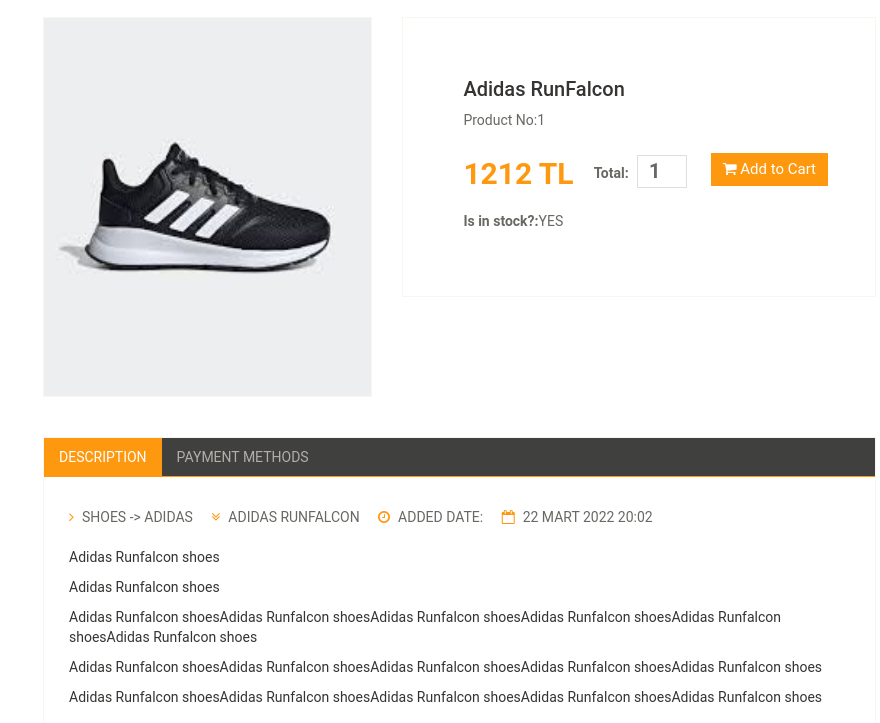

# Contents
* [About](#about)
* [Installation](#installation)
* [Tools and Technologies](#tools-and-technologies)
* [Main Features](#main-features)


# About

This sample web application, based on Django, is used to manage an e-commerce website. 
It has some functions for the administrator:

* Create Admin/Normal User
* Create category
* Create subcategory
* Create products
* Update products
* Manage orders
* Manage inventory
* Manage users
* Set different prices for admin and normal users

It also provides some functions for normal users:

* Authentication
* Add to shopping cart
* Search product
* Order product
* Track order

## Tools and Technologies

* Django
* SQL
* Bootstrap
* JavaScript

## Installation

Use the package manager [pip](https://pip.pypa.io/en/stable/) to install:

```bash
pip install -r requirements.txt
```
## Main Features

### Index Page

### View Products


### Search 


### Product Detail


## License
[GNU 3.0](https://github.com/omeraydemirr/driver-upgrade/blob/20574bfa70063ccf53e5fbc0084075671875a390/LICENSE)
